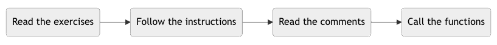

# StarkNet Cairo 101

**Comencemos usando Cairo con este simple tutorial.
Completa los ejercicios, obtén tokens y aprende sobre los contratos inteligentes de StarkNet!**

## Introducción

### Disclaimer

Usando esto, no esperes otro beneficio que aprender algunas cosas interesantes sobre StarkNet, el primer rollup de validez (validity rollup) de propósito general en la red principal de Ethereum (Mainnet).

StarkNet aún esta en Alpha. Esto significa que sigue en desarrollo, la pintura está fresca. Las cosas mejorarán, y mientras tanto, estamos haciendo que las cosas funcionen con un poco de cinta y alambres por aquí y por allí.

### Cómo funciona


**Completa los ejercicios y obtén tokens!**
Este workshop consiste en un conjunto de contratos inteligentes corriendo en la testnet de StarkNet Alpha. Cada contrato es un ejercicio - que remarca alguna característica/feature del lenguaje de programación Cairo.

Al completar el ejercicio se te acreditarán puntos en forma de [ERC20 token](contracts/token/TDERC20.cairo).

​Este workshop se enfoca en *leer* código Cairo y contratos inteligentes de StarkNet para entender su sintaxis. No es necesario programar o instalar nada en tu computadora para seguirlo y completarlo.

Va a tomarte algo de tiempo comenzar (hacer los primeros dos ejercicios) con el tutorial. Paciencia! una vez que estés allí, las cosas van a fluir mejor. ¡Estás aprendiendo!

### ¿Dónde me encuentro?

Este workshop es el primero en una serie cuyo objetivo es enseñar a construir en StarkNet. Puedes obtener más información en los siguientes links:

| Topic                                       | GitHub repo                                                                                |
| ------------------------------------------- | ------------------------------------------------------------------------------------------ |
| Aprende a leer código Cairo (Estás aquí)    | [Cairo 101](https://github.com/starknet-edu/starknet-cairo-101)                            |
| Despliega y edita un NFT ERC721             | [StarkNet ERC721](https://github.com/starknet-edu/starknet-erc721)                         |
| Despliega y edita un token ERC20            | [StarkNet ERC20](https://github.com/starknet-edu/starknet-erc20)                           |
| Construye una aplicacion multi-capa         | [Puente de mensajes de StarkNet](https://github.com/starknet-edu/starknet-messaging-bridge)|
| Debugea tus contratos Cairo fácilmente      | [StarkNet debug](https://github.com/starknet-edu/starknet-debug)                           |
| Diseña tu propio contrato de cuenta         | [Abstracción de cuenta de StarkNet](https://github.com/starknet-edu/starknet-accounts)     |

### Feedback y ayuda

Una vez que hayas terminado con este tutorial, tu feedback será muy apreciado!

**Por favor llena [este formulario](https://forms.reform.app/starkware/untitled-form-4/kaes2e) para dejarnos saber qué podemos mejorar.**

Y si se te complica seguir adelante, déjanos saber! La idea de este workshop es que sea lo más accesible posible; queremos saber si no es el caso.

¿Tienes alguna pregunta? Visita nuestro [Server de Discord](https://discord.gg/QypNMzkHbc), regístrate, y visita el canal #tutorials-support.

¿Estás interesado/a en seguir workshops online sobre aprender cómo desarrollar en StarkNet? [Subscríbete](http://eepurl.com/hFnpQ5)


### Contribuidores

Este proyecto puede mejorarse y va a evolucionar a medida que StarkNet madure. ¡Tus contribuciones son bienvenidas! Aquí hay algunas cosas que puedes hacer para ayudar:

- Crear una rama con la traducción a tu idioma.
- Corregir errores si encuentras alguno.
- Agregar explicaciones en los comentarios del ejercicio si sientes que necesita mejor explicación.
- Agregar ejercicios mostrando tus características favoritas de Cairo.

### Idiomas

Versión disponible en Mandarín 中文版本请查看这里[aquí](https://github.com/starknet-edu/starknet-cairo-101/tree/mandarin).
Versión disponible en Español [aquí](https://github.com/starknet-edu/starknet-cairo-101/tree/spanish).
​
## Comencemos

### Creando una smart contract wallet (billetera de contrato inteligente)
**Para completar este tutorial necesitas coleccionar puntos** Estos puntos van a ser adquiridos por el contrato inteligente que vas a desplegar.

- La forma mas fácil de iniciar una es usando Argent X ([descarga la extensión de chrome](https://chrome.google.com/webstore/detail/argent-x-starknet-wallet/dlcobpjiigpikoobohmabehhmhfoodbb/)  o  [checkea su repo](https://github.com/argentlabs/argent-x)) o Braavos ([descargar extensión de chrome](https://chrome.google.com/webstore/detail/braavos-wallet/jnlgamecbpmbajjfhmmmlhejkemejdma)). Estas billeteras son similares a lo que Metamask es para Ethereum y permite a los usuarios iniciar transacciones e interactuar con aplicaciones en StarkNet.
- Sigue las instrucciones  para instalar la extensión y desplegar una contrato de cuenta inteligente (puede tomar más o menos 5 minutos para ser desplegado). Por favor nota que en StarkNet solo hay un tipo de cuentas - cuentas de contrato inteligente (esto se llama Abstracción de cuenta), en contraste a Ethereum donde hay billeteras y contratos inteligentes. En otras palabras, cada billetera en StarkNet es un contrato inteligente y no existe distinción entre ellos y otros contratos. Por lo tanto, para crear una nueva billetera, necesitas desplegar una transacción que publique tu billetera de contrato inteligente a la red.
- Asegúrate de que estés en la red testnet de Goerli.
- Los puntos de este tutorial estan contenidos en el contrato `[0x5c6b1379f1d4c8a4f5db781a706b63a885f3f9570f7863629e99e2342ac344c](https://goerli.voyager.online/contract/0x5c6b1379f1d4c8a4f5db781a706b63a885f3f9570f7863629e99e2342ac344c)`. Clickea en "Add Token" (Agregar Token) en tu billetera instalada y la dirección del contrato para que tus puntos de balance aparezcan! Un nuevo token llamado SC101 (starknet-cairo-101) aparecerá en tu billetera.
- Conectar [Voyager](https://voyager.online/) a tu contrato de cuenta inteligente. Voyager está en el explorador de bloques para StarkNet (Equivalente a Etherscan para Ethereum) y te permite navegar el estado de la blockchain, ver todas las transacciones y sus estados. Conectar Voyager a tu billetera, te va a permitir enviar tus transacciones a través de la billetera.
- Para ejecutar transacciones en la red de prueba Goerli de StarkNet **vas a necesitar ETH de prueba para pagar el gas**. Para obtener un poco, ve a [faucet](https://faucet.goerli.starknet.io/) y sigue las instrucciones. Podría tomar varios minutos, pero deberías recibir algunos ETH Goerli L2 en tu billetera que puedes usar para ejecutar transacciones en la red de prueba. 

### Resolviendo ejercicios y obteniendo puntos
​**Cada ejercicio es un contrato inteligente separado.** Contiene código que, si se ejecuta correctamente, va a distribuir puntos en tu cuenta.

Los puntos son distribuidos por la función `distribute_points()` mientras la función `validate_exercise` registra que haz completado el ejercicio (puedes obtener puntos solo una vez). Tu objetivo es:


​

### Usando Voyager

Para este tutorial, vamos a interactuar con nuestros contratos a través de [Voyager](https://goerli.voyager.online/), el explorador de StarkNet. Por favor, asegúrate de conectar tu cuenta contrato de cuenta! Esto va a permitirte enviar tus transacciones a través de la billetera.

Cuando busques hacer algún contrato/transacción, siempre asegúrate de que estés en la versión Goerli de Voyager!

- Accede a tus transacciones con una URL de formato: [https://goerli.voyager.online/tx/tu-hash-de-transaccion](https://goerli.voyager.online/tx/tu-hash-de-transaccion).
- Accede al contrato con una URL de formato: [https://goerli.voyager.online/contract/tu-direccion-de-contrato](https://goerli.voyager.online/contract/tu-direccion-de-contrato)
- Accede a funciones de lectura/escritura del contrato en la tab "read/write contract" de Voyager.
​

## Direcciones de los ejercicios y contratos

| Tópico                                            | Código del contrato                                        | Contrato en Voyager                                                                                             |
| ------------------------------------------------- | --------------------------------------------------------- | ---------------------------------------------------------------------------------------------------------------- |
| Contador de puntos ERC20                          | [Contador de puntos ERC20](contracts/token/TDERC20.cairo) | [Link](https://goerli.voyager.online/contract/0x5c6b1379f1d4c8a4f5db781a706b63a885f3f9570f7863629e99e2342ac344c) |
| Sintaxis general                                  | [Ex01](contracts/ex01.cairo)                              | [Link](https://goerli.voyager.online/contract/0x29e2801df18d7333da856467c79aa3eb305724db57f386e3456f85d66cbd58b) |
| Variables de almacenamiento, getters, asserts     | [Ex02](contracts/ex02.cairo)                              | [Link](https://goerli.voyager.online/contract/0x18ef3fa8b5938a0059fa35ee6a04e314281a3e64724fe094c80e3720931f83f) |
| Leyendo y escribiendo variables de almacenamiento | [Ex03](contracts/ex03.cairo)                              | [Link](https://goerli.voyager.online/contract/0x79275e734d50d7122ef37bb939220a44d0b1ad5d8e92be9cdb043d85ec85e24) |
| Mappings                                          | [Ex04](contracts/ex04.cairo)                              | [Link](https://goerli.voyager.online/contract/0x2cca27cae57e70721d0869327cee5cb58098af4c74c7d046ce69485cd061df1) |
| Visibilidad de variables                          | [Ex05](contracts/ex05.cairo)                              | [Link](https://goerli.voyager.online/contract/0x399a3fdd57cad7ed2193bdbb00d84553cd449abbdfb62ccd4119eae96f827ad) |
| Visibilidad de funciones                          | [Ex06](contracts/ex06.cairo)                              | [Link](https://goerli.voyager.online/contract/0x718ece7af4fb1d9c82f78b7a356910d8c2a8d47d4ac357db27e2c34c2424582) |
| Comparando valores                                | [Ex07](contracts/ex07.cairo)                              | [Link](https://goerli.voyager.online/contract/0x3a1ad1cde69c9e7b87d70d2ea910522640063ccfb4875c3e33665f6f41d354a) |
| Recursiones nivel 1                               | [Ex08](contracts/ex08.cairo)                              | [Link](https://goerli.voyager.online/contract/0x15fa754c386aed6f0472674559b75358cde49db8b2aba8da31697c62001146c) |
| Recursiones nivel 2                               | [Ex09](contracts/ex09.cairo)                              | [Link](https://goerli.voyager.online/contract/0x2b9fcc1cfcb1ddf4663c8e7ac48fc87f84c91a8c2b99414c646900bf7ef5549) |
| Composability                                     | [Ex10](contracts/ex10.cairo)                              | [Link](https://goerli.voyager.online/contract/0x8415762f4b0b0f44e42ac1d103ac93c3ea94450a15bb65b99bbcc816a9388)   |
| Importando funciones                              | [Ex11](contracts/ex11.cairo)                              | [Link](https://goerli.voyager.online/contract/0xab5577b9be8948d89dbdba63370a3de92e72a23c4cacaea38b3a74eec3a872)  |
| Eventos                                           | [Ex12](contracts/ex12.cairo)                              | [Link](https://goerli.voyager.online/contract/0x24d15e02ddaa19d7ecd77204d35ed9bfff00a0cabc62eb3da5ba7680e44baf9) |
| Privacidad en StarkNet                            | [Ex13](contracts/ex13.cairo)                              | [Link](https://goerli.voyager.online/contract/0x2bae9190076c4252289b8a8671277cef57318192cff20c736808b0c71095895) |
| Multicall (Llamadas múltiples)                    | [Ex14](contracts/ex14.cairo)                              | [Link](https://goerli.voyager.online/contract/0xed7ddffe1370fbbc1974ab8122d1d9bd7e3da8d829ead9177ea4249b4caef1)  |

### Contando tus puntos

​Tus puntos serian acreditados en tu billetera instalada; aunque esto puede llevar algo de tiempo. Si quieres monitorear tus puntos en tiempo real, también puedes ver tu balance en voyager!
​
- Ve al [contador ERC20](https://goerli.voyager.online/contract/0x5c6b1379f1d4c8a4f5db781a706b63a885f3f9570f7863629e99e2342ac344c#readContract) en Voyager, en la tab "read contract".
- Ingresa tu dirección en la función "balanceOf".

Tambien puede checkear tu progreso general [aquí](https://starknet-tutorials.vercel.app).
​

### Estado de la transacción

​Si envías un transacción y es mostrada como "undetected" en Voyager, esto puede significar dos cosas:

- Tu transacción está pendiente y va a ser incluida en un bloque pronto. Luego será visible en Voyager.
- Tu transacción fué inválida y NO será incluida en un bloque (no existe tal cosa como transacción fallida en StarkNet).

Puedes (y deberías) checkear el estado de tu transacción con la siguiente URL ​[https://alpha4.starknet.io/feeder_gateway/get_transaction_receipt?transactionHash=](https://alpha4.starknet.io/feeder_gateway/get_transaction_receipt?transactionHash=), donde puedes concatenar tu hash de transacción.
​
​## Reutilizando este proyecto

- Clona el repositorio en tu máquina.
- Haz el setup del entorno siguiendo [estas instrucciones](https://starknet.io/docs/quickstart.html#quickstart).
- Instala [Nile](https://github.com/OpenZeppelin/nile).
- Verifica que el proyecto compile.

```bash
nile compile
```
