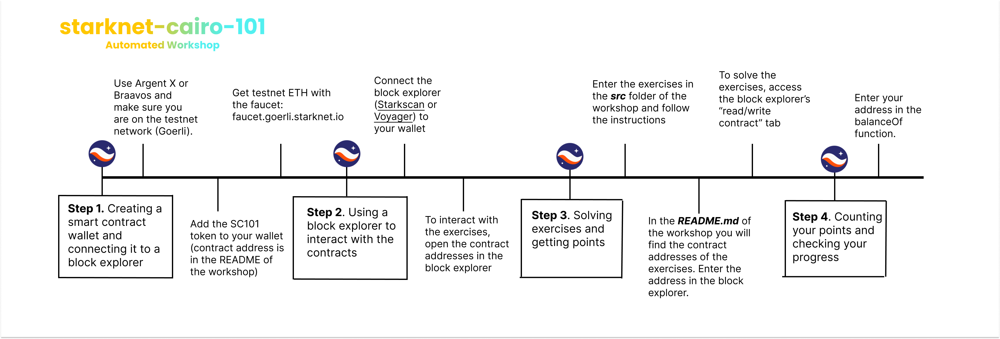

# Starknet Cairo 101 Automated Workshop

Welcome!

This tutorial is made for developers who are interested in learning how to read Cairo 1 code and Starknet smart contracts. By following it, you'll be able to get started in no time. Have fun!

## Introduction​

Welcome to Starknet, a general-purpose Validity Rollup on top of Ethereum mainnet. Starknet is a layer 2 scaling solution that lets developers build decentralised applications without compromising on security, scalability and decentralization.

This workshop is designed to help you read Cairo 1 code and Starknet smart contracts, and understand their syntax. Don't worry, you don't need to code or install anything on your machine to follow and complete it. **You can do it all from your browser**.

The exercices are a set of smart contracts deployed on Starknet Alpha on testnet. Each smart contract is an exercise/puzzle that outlines a feature of the Cairo Smart contract language.

Completing the exercises will earn you points in the form of an [ERC20 token](contracts/token/TDERC20.cairo). The token does not have any monetary value, but it's a fun way to track your learning progresses.

We hope you have fun participating in this workshop!

## What you will learn

- How to read Cairo 1 code
- How to read Starknet smart contracts
- How to interact with Starknet smart contracts using a browser wallet and a block explorer.

### Disclaimer

​Don’t expect any benefit from using this other than learning some cool stuff about Starknet, the first general-purpose Validity Rollup on the Ethereum mainnnet.

## Steps

### 1. Creating a smart contract wallet and connecting it to a Block Explorer

**To complete the tutorial, you need to collect points.** You will own these points through your Starknet wallet.

- The easiest way to set one up is to use Argent X ([download the chrome extension](https://chrome.google.com/webstore/detail/argent-x-starknet-wallet/dlcobpjiigpikoobohmabehhmhfoodbb/)  or  [check their repo](https://github.com/argentlabs/argent-x)) or Braavos ([download the chrome extension](https://chrome.google.com/webstore/detail/braavos-wallet/jnlgamecbpmbajjfhmmmlhejkemejdma)).
These wallet solutions are for Starknet  what Metamask is for Ethereum. They allow users to initiate transactions and interact with applications on Starknet.
- Follow the instructions in your wallet app to install the extension. It may take approximately 5 minutes for the account to be deployed. Note that in Starknet, there is only one type of account: smart contract accounts. To create a new wallet, you need to send a transaction that publishes your smart contract wallet to the network.
- Make sure you are on the Goerli testnet network.
- The tutorial’s points are held in contract  `0x044f65adbdb59bf1db71e8b69efb7c9d0b810db94c1730a05fa5751b02d396de` ([Starkscan link](https://testnet.starkscan.co/contract/0x044f65adbdb59bf1db71e8b69efb7c9d0b810db94c1730a05fa5751b02d396de), [Voyager link](https://goerli.voyager.online/contract/0x044f65adbdb59bf1db71e8b69efb7c9d0b810db94c1730a05fa5751b02d396de)). Click "Add Token" in your installed wallet and add the tutorial contract address so that your points balance appears there. A new token called `SC101` (starknet-cairo-101) will appear in your wallet.
- To execute transactions on the Goerli Starknet testnet, you will need testnet ETH to pay for gas. You have two options:
    - Go to the [faucet](https://faucet.goerli.starknet.io/) and follow the instructions. It may take a few minutes
    - Go to [Starkgate](https://goerli.starkgate.starknet.io/) and bridge Goerli Eth from Ethereum to Starknet

### 2. Use a Block Explorer to interact with the contracts

To finish this workshop, you have to interact with the exercises/smart contracts through a block explorer.

You can use either [Starkscan](https://testnet.starkscan.co/) or [Voyager](https://goerli.voyager.online/). These are for Starknet what Etherscan is for Ethereum. They  allow you to browse the state of the blockchain and view all transactions and their status.

By connecting your wallet to the block explorer, you will be able to send your transactions to the network and interact with the exercises in the tutorial.

When looking for a contract/transaction, always ensure you are on the Goerli version of the Block Explorer. To solve the exercises, access the contract’s functions by using the `read`/`write` tab in the explorer.​

### 3. Solving exercises and getting points​
​
**Each exercise is a separate smart contract.** It contains code that, when executed correctly, will distribute points to your address.

To solve an exercise, follow the link below to read its code. Read the comments, and follow the instructions to understand the code. Your goal is to get each exercice to call succesfully the function `distribute_points()`, which will send you ERC20 points.

During validation, exercises often also call `validate_exercise()`, which records that you completed an exercise and prohibit you from collecting points various times.

Each exercise is deployed on the Goerli testnet, and you will need to interact with them through a Block Explorer. You can find the addresses of the contracts in the table below.

| Topic                                 | Contract code                                         | Contract on Starkscan                                                                                              | Contract on Voyager                                                                                              |
| ------------------------------------- | ----------------------------------------------------- | ---------------------------------------------------------------------------------------------------------------- | ---------------------------------------------------------------------------------------------------------------- |
| General syntax                        | [Ex01](src/ex01.cairo)                          | [Link](https://testnet.starkscan.co/contract/0x031d1866cb827c4e27bbca9ffee59fa2158b679413ffb58c3f90af56e1140e85) | [Link](https://goerli.voyager.online/contract/0x031d1866cb827c4e27bbca9ffee59fa2158b679413ffb58c3f90af56e1140e85) |
| Storage variables, getters, asserts   | [Ex02](src/ex02.cairo)                          | [Link](https://testnet.starkscan.co/contract/0x0600f8fe0752e598b4e6b27839f00ad65215d129f385e12931323c487b6f9b36) | [Link](https://goerli.voyager.online/contract/0x0600f8fe0752e598b4e6b27839f00ad65215d129f385e12931323c487b6f9b36) |
| Reading and writing storage variables | [Ex03](src/ex03.cairo)                          | [Link](https://testnet.starkscan.co/contract/0x033d5fc40c0e262612528a9a652ada70be854d98241fb7548745262b5273c9d1) | [Link](https://goerli.voyager.online/contract/0x033d5fc40c0e262612528a9a652ada70be854d98241fb7548745262b5273c9d1) |
| Mappings                              | [Ex04](src/ex04.cairo)                          | [Link](https://testnet.starkscan.co/contract/0x06967cd33c6e064087123958e239c98f0de5e6d663660fa16a2526e8b115688a) | [Link](https://goerli.voyager.online/contract/0x06967cd33c6e064087123958e239c98f0de5e6d663660fa16a2526e8b115688a) |
| Variable visibility                   | [Ex05](src/ex05.cairo)                          | [Link](https://testnet.starkscan.co/contract/0x076c32e000f7112724bba3c5f51fb1290217a1010ae555e6ecbdb2bfe6613e33) | [Link](https://goerli.voyager.online/contract/0x076c32e000f7112724bba3c5f51fb1290217a1010ae555e6ecbdb2bfe6613e33) |
| Functions visibility                  | [Ex06](src/ex06.cairo)                          | [Link](https://testnet.starkscan.co/contract/0x060987aea322cd12657588b6cdb0892db79322ab4533f7d74838ff2e2614a015) | [Link](https://goerli.voyager.online/contract/0x060987aea322cd12657588b6cdb0892db79322ab4533f7d74838ff2e2614a015) |
| Comparing values                      | [Ex07](src/ex07.cairo)                          | [Link](https://testnet.starkscan.co/contract/0x006051096480f375894eebb99948bce14a84c25093636c4b4e8222cc32a67cf0) | [Link](https://goerli.voyager.online/contract/0x006051096480f375894eebb99948bce14a84c25093636c4b4e8222cc32a67cf0) |
| Recursions level 1                    | [Ex08](src/ex08.cairo)                          | [Link](https://testnet.starkscan.co/contract/0x01ec8e981b1b6a7256a71f21790dd07cafeb15d02c18534a2bd4a6c8551860aa) | [Link](https://goerli.voyager.online/contract/0x01ec8e981b1b6a7256a71f21790dd07cafeb15d02c18534a2bd4a6c8551860aa) |
| Recursions level 2                    | [Ex09](src/ex09.cairo)                          | [Link](https://testnet.starkscan.co/contract/0x053b96c4ee027c53ea001479f24c10b543063e3c26d037c600e5bd31f0b21e5c) | [Link](https://goerli.voyager.online/contract/0x053b96c4ee027c53ea001479f24c10b543063e3c26d037c600e5bd31f0b21e5c) |
| Composability                         | [Ex10](src/ex10.cairo)                          | [Link](https://testnet.starkscan.co/contract/0x0763e89551900eba82d757a9f3862935cc7f7e47538f01ddba514f23d9a5f6e0) | [Link](https://goerli.voyager.online/contract/0x0763e89551900eba82d757a9f3862935cc7f7e47538f01ddba514f23d9a5f6e0) |
| Importing functions                   | [Ex11](src/ex11.cairo)                          | [Link](https://testnet.starkscan.co/contract/0x029a9a484d22a6353eff0d60ea56c6ffabaaac5e4889182287ef1d261578b197) | [Link](https://goerli.voyager.online/contract/0x029a9a484d22a6353eff0d60ea56c6ffabaaac5e4889182287ef1d261578b197) |
| Events                                | [Ex12](src/ex12.cairo)                          | [Link](https://testnet.starkscan.co/contract/0x04a221a8e3155fb03d1708881213a2ecdb05a41cf0ae6de83ddcf8f12bb04282) | [Link](https://goerli.voyager.online/contract/0x04a221a8e3155fb03d1708881213a2ecdb05a41cf0ae6de83ddcf8f12bb04282) |
| Privacy on Starknet                   | [Ex13](src/ex13.cairo)                          | [Link](https://testnet.starkscan.co/contract/0x067ed1d23c5cc3a34fb86edd4f8415250c79a374e87bcf2e6870321261ca9b0f) | [Link](https://goerli.voyager.online/contract/0x067ed1d23c5cc3a34fb86edd4f8415250c79a374e87bcf2e6870321261ca9b0f) |
| Multicall                             | [Ex14](src/ex14.cairo)                          | [Link](https://testnet.starkscan.co/contract/0x031e9a701a24c1d2ecd576208087dfa52f1025072cf11e54407300f64f95ce5f) | [Link](https://goerli.voyager.online/contract/0x031e9a701a24c1d2ecd576208087dfa52f1025072cf11e54407300f64f95ce5f) |

### 4. Counting your points and checking your progress

Your points will be credited to your wallet, though this may take some time. If you want to monitor your points count in real-time, you can also check your balance in a block explorer!
- Go to the  ERC20 counter on [Voyager](https://goerli.voyager.online/contract/0x044f65adbdb59bf1db71e8b69efb7c9d0b810db94c1730a05fa5751b02d396de) or [Starkscan](https://testnet.starkscan.co/contract/0x044f65adbdb59bf1db71e8b69efb7c9d0b810db94c1730a05fa5751b02d396de) in the "read contract" tab.
- Enter your address in the `balanceOf` function.​

Enjoy the workshop! If you have any questions, feel free to contact us on [Discord](https://starknet.io/discord). We are happy to help!

---

## Contributing to improve this workshop

This project can be made better and will evolve. Your contributions are welcome! Go to the [CONTRIBUTING](CONTRIBUTING.md) file for more information on how to setup your environment and contribute to the project.

Here are **some** things that you can do to help:

- Create a branch with a translation to your language
- Correct bugs if you find some
- Add an explanation in the comments of the exercise if you feel it needs more explanation
- Add exercises showcasing your favorite Cairo feature
- Add a new tutorial to the series

## Other Automated Workshops

This workshop is the first in a series aimed at teaching how to build on Starknet. Checkout out other workshops in the series:

| Topic                                       | GitHub repo                                                                            |
| ------------------------------------------- | -------------------------------------------------------------------------------------- |
| Learn how to read Cairo code (you are here) | [Cairo 101](https://github.com/starknet-edu/starknet-cairo-101)                        |
| Deploy and customize an ERC721 NFT          | [Starknet ERC721](https://github.com/starknet-edu/starknet-erc721)                     |
| Deploy and customize an ERC20 token         | [Starknet ERC20](https://github.com/starknet-edu/starknet-erc20)                       |
| Build a cross-layer application             | [Starknet messaging bridge](https://github.com/starknet-edu/starknet-messaging-bridge) |
| Debug your Cairo contracts easily           | [Starknet debug](https://github.com/starknet-edu/starknet-debug)                       |
| Design your own account contract            | [Starknet account abstraction](https://github.com/starknet-edu/starknet-accounts)      |

### Providing feedback & getting help

Once you are done working on this tutorial, your feedback will be greatly appreciated!

**Please fill out [this form](https://forms.reform.app/starkware/untitled-form-4/kaes2e) to let us know what we can do to make it better.**

​
And if you struggle to move forward, do let us know! This workshop is meant to be as accessible as possible; we want to see if it’s not the case.
​
Do you have a question? Join our [Discord server](https://starknet.io/discord), register, and join channel #tutorials-support.

Are you interested in attending online workshops about dev on Starknet? [Subscribe here](https://starknet.substack.com/)

## Languages

- (not updated) A Spanish version is available [here](https://github.com/starknet-edu/starknet-cairo-101/tree/spanish).
- (not updated) A Portuguese version is available [here](./README.pt.md).
- (not updated) A Korean version is available [here](./README.kr.md).